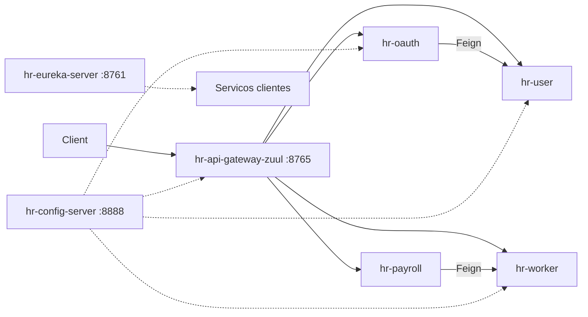

# microsservicos-payment-management

Projeto de estudo de **microsserviços de gestão de pagamento (HR)** com Spring Cloud. O sistema calcula o pagamento de trabalhadores (`dailyIncome × days`), gerencia usuários e papéis, e protege as APIs com **OAuth2 + JWT**, usando Eureka, Config Server e API Gateway (Zuul).

## Arquitetura



Fluxo resumido:

- O cliente acessa apenas o **gateway** (`:8765`), que valida JWT e roteia para os serviços.
- `hr-payroll` consulta `hr-worker` via **OpenFeign** (com fallback **Hystrix**).
- `hr-oauth` busca usuários em `hr-user` via Feign para emitir tokens.
- Configurações sensíveis vêm do **Config Server** (repositório Git externo).
- Os serviços se registram no **Eureka** para descoberta.

## Serviços

| Serviço | Porta | Função |
|---------|-------|--------|
| `hr-config-server` | 8888 | Configuração centralizada via GitHub [`microsservicos-configs`](https://github.com/FabioBritto/microsservicos-configs) |
| `hr-eureka-server` | 8761 | Service discovery |
| `hr-api-gateway-zuul` | 8765 | API Gateway + resource server JWT |
| `hr-oauth` | dinâmica | Authorization server (password grant, JWT) |
| `hr-worker` | dinâmica | Consulta de workers (JPA) |
| `hr-user` | dinâmica | Usuários e roles (JPA) |
| `hr-payroll` | dinâmica | Cálculo de payment via Feign + Hystrix |

### Rotas do gateway

| Path | Serviço |
|------|---------|
| `/hr-worker/**` | `hr-worker` |
| `/hr-payroll/**` | `hr-payroll` |
| `/hr-user/**` | `hr-user` |
| `/hr-oauth/**` | `hr-oauth` |

## Stack

- **Java 11**
- **Spring Boot** 2.3.4 / **Spring Cloud** Hoxton
- Netflix Eureka, Zuul, Hystrix, Ribbon
- Spring Cloud Config Server
- OpenFeign
- Spring Cloud OAuth2 + JWT
- Spring Data JPA (H2 / PostgreSQL)
- Maven Wrapper (`./mvnw`) por serviço
- Dockerfiles por serviço (exceto `hr-api-gateway-zuul`)

## Estrutura do repositório

```
micro-services/
├── hr-config-server/      # Config Server
├── hr-eureka-server/      # Eureka
├── hr-api-gateway-zuul/   # Gateway
├── hr-oauth/              # Auth
├── hr-worker/             # Domínio workers
├── hr-user/               # Domínio usuários
├── hr-payroll/            # Cálculo de pagamento
└── config.env             # Credenciais Git do Config Server (não versionar secrets)
```

Configs de runtime dos serviços (JWT, OAuth client, banco em `prod`, etc.) ficam no repositório externo [`microsservicos-configs`](https://github.com/FabioBritto/microsservicos-configs).

## Como executar

Não há POM agregador nem `docker-compose` na raiz. Suba cada serviço com o Maven Wrapper, nesta ordem:

1. **Config Server** — defina `GIT_USERNAME` e `GIT_PASSWORD` (use `config.env` como referência, sem commitá-lo com secrets).
2. **Eureka Server**
3. **hr-worker**, **hr-user**, **hr-oauth**, **hr-payroll**
4. **hr-api-gateway-zuul**

Em cada pasta de serviço:

```bash
./mvnw spring-boot:run
```

Ou, onde houver `Dockerfile`, faça o build do JAR e da imagem:

```bash
./mvnw package -DskipTests
docker build -t <nome-do-servico> .
```

Os `application.properties` apontam para hostnames como `hr-eureka-server` e `hr-config-server` (adequados a rede Docker/DNS). Em execução local, ajuste as URLs ou mapeie esses nomes no `/etc/hosts`.

## Endpoints (via gateway `:8765`)

| Método | Path | Descrição |
|--------|------|-----------|
| `POST` | `/hr-oauth/oauth/token` | Obtém token OAuth2 (password grant) |
| `GET` | `/hr-worker/workers` | Lista workers |
| `GET` | `/hr-worker/workers/{id}` | Busca worker por id |
| `GET` | `/hr-payroll/payments/{workerId}/days/{days}` | Calcula pagamento |
| `GET` | `/hr-user/users/{id}` | Busca usuário por id |
| `GET` | `/hr-user/users/search?email=` | Busca usuário por e-mail |

### Autorização

- Endpoint de token: público
- `GET` em workers: role **OPERATOR**
- Payroll, user e actuator: role **ADMIN**

## Dados de seed

**Workers** (`hr-worker`): Bob (200.0), Maria (300.0), Alex (250.0).

**Usuários** (`hr-user`):

| Usuário | Roles |
|---------|-------|
| Fabio Britto | `ROLE_OPERATOR` |
| Priscila Britto | `ROLE_OPERATOR`, `ROLE_ADMIN` |

As senhas de seed estão documentadas nos comentários de `hr-user/src/main/resources/data.sql`.
